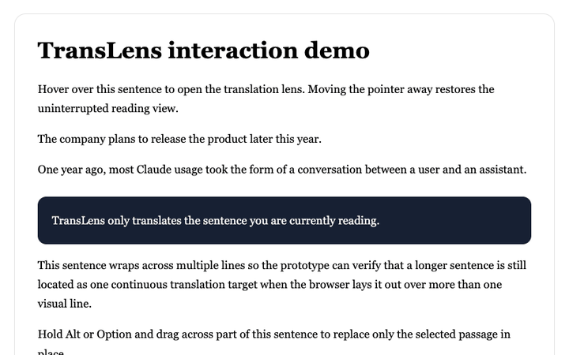

# 译镜 TransLens

> 隐私优先的多语言 Chrome 悬停翻译扩展：鼠标停在单词或短语上，即可在原文位置查看译文。

译镜 TransLens 将翻译放回网页原来的文字位置。它支持自动或手动指定源语言、选择目标语言，并优先使用 Chrome 的本地 Translator API，不把网页文字上传到项目服务器。

[隐私说明](PRIVACY.md) · [更新日志](CHANGELOG.md) · [MIT License](LICENSE) · [参与贡献](CONTRIBUTING.md)



## 项目状态

- 当前版本：`0.15.0`
- Chrome：需要 138 或更高版本
- 项目状态：可从源码加载和测试；Chrome Web Store 版本尚待发布
- 翻译引擎：Chrome 本地 Translator API，语言对和模型可用性由浏览器决定

## 核心功能

- 悬停在实际文字上时翻译对应的单词或局部语义短语，避免悬停在空白区域时显示空结果；
- 自动检测源语言，也可以手动指定源语言；目标语言由用户选择；
- 译文锚定在命中的原文行，不把局部短语排版到远处；
- 按住 Mac 的 `⌥ Option` 或 Windows/Linux 的 `Alt` 可轻点吸附整句，或拖动精确选择文字；
- 翻译按需准备并缓存，不打开网页就翻译整页；
- 自动跳过输入框、密码框、代码区和可编辑区域；
- 支持全局开关、网站禁用名单、墨迹范围和笔迹粗细调整；
- 默认使用 Chrome 本地翻译，不提供云翻译，也不会把网页文字上传到 TransLens 服务器。

## 当前版本：0.15.0

- 悬停模式固定使用鼠标所在单词附近的语义短语；按住 `Alt/Option` 轻点仍可固定整句；
- 支持自动检测源语言、手动指定源语言和用户选择目标语言；
- 普通网页刷新后监听器会自动就绪，点按 `Alt/Option` 即可开启悬停墨迹，无需先打开插件；
- 开启后，120 px 墨迹遮罩跟随鼠标，默认只揭开命中的单词；遇到明显的语法连接词时最多扩展为 2–4 词短语；
- 悬停翻译只在鼠标中心命中实际文字后触发，翻译目标为该位置对应的单词或语义短语；
- 短语译文锚定在鼠标命中的原文行，不再使用整段内容宽度进行排版；
- 短语跨行时只清理当前命中行与译文实际占用区域，避免原文被遮住后译文出现在远处；
- 墨迹范围可在 40–300 px 之间调整；
- 点按 `Alt/Option` 可开启或关闭当前页面的悬停墨迹；
- 按下 `Alt/Option` 会立即隐藏悬停墨迹并恢复完整原文，长按拖选不会误触开关；
- 墨迹边缘附近的译文按需准备并缓存，不会在打开网页时一次翻译整页；
- 同一段落的悬停墨迹一次只渲染一个短语译文，同一短语内部移动不会反复切换；
- 短语悬停只清理当前命中原文行与译文实际占用区域，避免两侧残留英文阴影；
- `and / or / but` 前后的词会在必要时组成最多 4 词的局部短语，不再把整段内容机械切块；
- 悬停短语译文使用命中原文行的局部宽度，并在空间不足时适度调整字号和行高；固定整句译文仍使用原内容区域宽度；
- 按住 `Alt/Option` 拖选时，笔迹会根据拖动速度改变粗细，并沿路径连续揭示；
- 按住 `Alt/Option` 轻点或轻划会自动吸附完整句子，即使句子横跨多行；明确拖动则保留精确跨行选区；
- 轻点吸附整句时，短笔迹会整理成逐行圆润墨迹，并覆盖译文实际占用的行；
- 精确拖动支持任意方向涂抹、回头和绕圈；扫过的文本范围只会累积，松手后保留实际笔迹形状；
- 拖选译文使用透明文字层，原文底色按实际文字行完全清除，不使用会漏出原文字形的边缘羽化；
- 译文与原文共享相同的位置、宽度、字体尺寸和页面底色；
- 墨迹颜色根据附近网页背景与文字颜色自动协调；
- 墨迹静止时会缓慢呼吸流动，移动时形变会短暂加速，停下后再柔和收敛；
- 鼠标经过行间空白时会短暂保留墨迹，减少闪烁；
- 按住 `Alt/Option` 可拖选一句话、短语或几个单词；
- 点击别处或按 `Esc` 收起拖选笔迹并恢复完整原文；
- 按键手势固定译文后，普通鼠标移动、移出文字区域或窗口短暂失焦都不会让它消失；
- 可调整墨迹揭示范围；
- 可独立调整毛笔拖选的笔迹粗细；
- 默认优先使用 Chrome 本地翻译，不会在普通网页中显示假译文；
- 设置页会检测 Chrome 本地翻译能力，并由用户主动准备语言模型；
- 显示模型下载进度、就绪状态和不可用原因；
- 自动跳过输入框、密码框、编辑区、代码区和不可见文字；
- 支持全局开关和网站禁用名单；
- 不修改网页原始文字节点。

## 本地加载

1. 确认已安装 Chrome 138 或更高版本；
2. 运行 `npm run check`（会测试并构建扩展）；
3. 在 Chrome 地址栏打开 `chrome://extensions`；
4. 开启右上角“开发者模式”；
5. 点击“加载已解压的扩展程序”；
6. 选择本项目中的 `dist` 文件夹；
7. 首次安装会打开设置页，点击“准备本地翻译”并等待模型就绪；
8. 打开或刷新普通网页，译镜会自动载入，不需要先点击插件图标；
9. 用鼠标扫过文字查看原位译文；点按 Mac 的 `⌥ Option` 或 Windows/Linux 的 `Alt` 可开关悬停墨迹，按住后轻点文字可翻译完整句子，明显拖动则精确选择文字。

可以先打开 `demo/index.html` 验证文档中约定的四条演示译文。扩展不能在 `chrome://` 页面或 Chrome Web Store 页面中运行。

## 关于翻译引擎

“交互演示”只用于验证项目测试页中预置的短语和句子。普通网页中没有预置译文时会提示准备本地翻译，不再显示占位译文。

“Chrome 本地翻译”会检测当前浏览器是否提供 Translator API。设置页支持自动检测源语言或手动指定源语言，并选择目标语言。首次使用时需要点击“准备本地翻译”，Chrome 会按语言对下载本地语言包并显示进度；自动检测模式会在首次悬停时根据句子上下文确定源语言。准备完成后译镜会自动切换到本地引擎，悬停文字不会上传到服务器；若设备或语言对不支持，设置页会显示具体状态并保留演示模式。Chrome 当前支持的语言列表以浏览器实现为准，详情见 [Translator API 语言列表](https://developer.chrome.com/docs/ai/translator-api)。

## 开发检查

```sh
npm run check
```

该命令会运行核心文本处理测试、检查扩展文件引用，并重新生成 `dist`。


## 权限与隐私

- 扩展会在普通 HTTP/HTTPS 网页中自动载入，因此刷新后点按 `Alt/Option` 仍可直接使用；
- 自动载入不等于读取整页：只有鼠标附近、满足翻译条件的文字才会被处理；
- 输入框、密码框、代码区和可编辑区域始终跳过；
- 可随时通过弹窗全局关闭，或单独禁用当前网站；
- 详细说明见 [PRIVACY.md](PRIVACY.md)。

## 当前限制

- Chrome 本地 Translator API 和具体语言包由浏览器提供；设备、地区或语言对不支持时，扩展会显示状态提示；
- 扩展不能在 `chrome://` 页面、Chrome Web Store 页面以及其他受浏览器保护的页面中运行；
- 当前版本不提供云端翻译或跨设备同步；
- 不同网页的字体、布局和动态渲染方式可能影响局部译文的定位效果。

## 参与贡献

欢迎提交 Bug、功能建议和 Pull Request。请先阅读 [CONTRIBUTING.md](CONTRIBUTING.md)，安全问题请按照 [SECURITY.md](SECURITY.md) 私下报告。

## 许可证

本项目源代码采用 [MIT License](LICENSE) 发布。第三方资源和依赖仍分别受其原有许可约束。
